# Main.py Application Flow

This document explains the step-by-step flow when running `python main.py` for the SET Portfolio Management Application.

## Flowchart Diagram

```mermaid
flowchart TD
    A["`**Start: python main.py**`"] --> B[Parse Command Line Arguments]
    B --> C[Initialize FastAPI App]
    C --> D[Add CORS Middleware]
    D --> E[Load Environment Variables]
    E --> F[Setup Database Connection]
    F --> G["`**Server Startup Event Triggered**
    @app.on_event('startup')`"]
    
    G --> H["`🌟 Server starting up - running Python scripts...`"]
    
    H --> I1["`📥 Download NVDR Excel
    (download_nvdr_excel.py)
    Timeout: 90s`"]
    
    I1 --> I2["`📥 Download Short Sales Excel
    (download_short_sales_excel.py)
    Timeout: 90s`"]
    
    I2 --> I3["`📥 Scrape SET Index Data
    (scrape_set_index.py --save-db)`"]
    
    I3 --> I4["`📥 Scrape Sector Data
    (scrape_sector_data.py)
    Output: _out/sectors_{timestamp}/`"]
    
    I4 --> I5["`📥 Scrape Investor Data
    (scrape_investor_data.py --market SET)
    Output: _out/investor/`"]
    
    I5 --> J["`💾 Save All Data to Supabase Database`"]
    
    J --> J1[Save NVDR Trading Data]
    J1 --> J2[Save Short Sales Data]
    J2 --> J3[Save Sector Constituents]
    J3 --> J4[Save Investor Summary Data]
    J4 --> J5[Save SET Index Data]
    
    J5 --> K["`✅ Database Save Complete`"]
    
    K --> L["`🚀 Start Background Refresh Task
    (Every 30 minutes)`"]
    
    L --> M["`🌐 Start Web Server
    Host: 0.0.0.0
    Port: 8000 (default)`"]
    
    M --> N["`📱 Web Interface Available
    - Portfolio Dashboard
    - Data Export APIs
    - Progress Monitoring`"]
    
    N --> O["`🔄 Background Refresh Loop`"]
    O --> P[Wait 30 Minutes]
    P --> Q[Re-run All Scrapers]
    Q --> R[Update Database]
    R --> O
    
    style A fill:#e1f5fe
    style G fill:#fff3e0
    style I1 fill:#f3e5f5
    style I2 fill:#f3e5f5
    style I3 fill:#f3e5f5
    style I4 fill:#f3e5f5
    style I5 fill:#f3e5f5
    style J fill:#e8f5e8
    style M fill:#e3f2fd
    style O fill:#fff8e1
```



## Detailed Step-by-Step Flow

### 1. Application Initialization
**Location:** `main.py:2515-2522`

```python
if __name__ == "__main__":
    import argparse
    parser = argparse.ArgumentParser(description='SET Portfolio Dashboard Server')
    parser.add_argument('--port', type=int, default=8000, help='Port to run the server on (default: 8000)')
    parser.add_argument('--host', type=str, default="0.0.0.0", help='Host to bind to (default: 0.0.0.0)')
    args = parser.parse_args()
    
    uvicorn.run(app, host=args.host, port=args.port)
```

- Parse command line arguments for host and port configuration
- Initialize FastAPI application instance
- Add CORS middleware for cross-origin requests
- Load environment variables from `.env` file

### 2. Server Startup Event
**Location:** `main.py:70-240`

The `@app.on_event("startup")` decorator triggers automatic data collection:

#### 2.1 NVDR Excel Download
```bash
python download_nvdr_excel.py --out _out/nvdr_{timestamp}.xlsx --timeout 90000
```
- Downloads NVDR trading-by-stock Excel file from SET website
- Uses Playwright for browser automation
- 90-second timeout for reliability

#### 2.2 Short Sales Excel Download
```bash
python download_short_sales_excel.py --out _out/short_sales_{timestamp}.xlsx --timeout 90000
```
- Downloads short sales Excel file from SET website
- Uses Playwright for browser automation
- 90-second timeout for reliability

#### 2.3 SET Index Data Scraping
```bash
python scrape_set_index.py --save-db
```
- Scrapes SET index data directly
- Automatically saves to database
- Used for portfolio dashboard charts

#### 2.4 Sector Data Scraping
```bash
python scrape_sector_data.py --outdir _out/sectors_{timestamp}
```
- Scrapes all 8 SET sectors (agro, consump, fincial, indus, propcon, resourc, service, tech)
- Downloads constituent stock lists with weights
- Concurrent processing for performance

#### 2.5 Investor Data Scraping
```bash
python scrape_investor_data.py --market SET --out-table _out/investor/investor_table_SET_{timestamp}.csv
```
- Scrapes investor type breakdown data
- Uses Jina.ai proxy for reliability
- Supports both SET and MAI markets

### 3. Database Operations
**Location:** `main.py:133-240`

After all scrapers complete, data is automatically saved to Supabase:

```python
from supabase_database import get_proper_db
db = get_proper_db()

# Save NVDR data (extracts actual trade date from Excel)
db.save_nvdr_trading(latest_nvdr_file, None)

# Save Short Sales data (extracts actual trade date from Excel)  
db.save_short_sales_trading(latest_short_file, None)

# Save Sector constituents
db.save_sector_constituents(latest_sector_dir, None)

# Save Investor summary data
db.save_investor_summary(latest_investor_file, None)
```

- Automatically extracts actual trade dates from Excel files
- Uses proper database schema for each data type
- Handles data validation and error cases

### 4. Background Refresh System
**Location:** `background_updater.py`

A separate background task runs every 30 minutes:

```python
async def scheduled_data_refresh():
    while True:
        await asyncio.sleep(1800)  # 30 minutes
        await startup_data_refresh()  # Re-run all scrapers
```

- Ensures data stays current throughout the day
- Re-runs all scraping operations automatically
- Updates database with fresh data

### 5. Web Server Ready
**Location:** `main.py:2522`

The server starts on the configured host and port:

```python
uvicorn.run(app, host=args.host, port=args.port)
```

**Default URL:** `http://localhost:8000`

### 6. Available Web Interface

Once the server is running, these endpoints become available:

#### Dashboard
- `GET /` - Portfolio dashboard (loads data from database only)
- `GET /portfolio` - Full portfolio interface

#### Data Export APIs
- `GET /api/nvdr/export.xlsx` - Download latest NVDR Excel
- `GET /api/short-sales/export.xlsx` - Download latest Short Sales Excel
- `GET /api/investor/table.csv?market=SET|MAI` - Investor table CSV
- `GET /api/investor/chart.json?market=SET|MAI` - Investor chart JSON
- `GET /api/sector/constituents.csv?slug={sector}` - Sector constituents

#### Database Operations
- `POST /api/save-to-database` - Manual database save trigger
- `GET /api/progress` - Real-time progress monitoring (SSE)
- `GET /api/progress/status` - Current progress status

## Key Architecture Benefits

### 1. **Reliable Background Refresh**
- Fresh data downloaded immediately on server startup
- All data saved to database before web interface becomes available
- Automatic 30-minute refresh cycle keeps data current

### 2. **Fast Frontend Performance**
- Portfolio dashboard loads data from database only
- Users see current data instantly with no loading delays
- No waiting for external scraping operations

### 3. **Robust Error Handling**
- Each scraper has configurable timeouts (45-120 seconds)
- Comprehensive error handling with detailed logging
- Fallback mechanisms for sector data

### 4. **Efficient File Management**
- `_out/` directory contains all generated files with timestamps
- Files named with format: `{type}_{YYYYMMDD_HHMMSS}.xlsx`
- Automatic cleanup and organization

## Environment Requirements

### Required Environment Variables
```bash
SUPABASE_URL=your_supabase_project_url
SUPABASE_SERVICE_KEY=your_supabase_service_role_key
```

### Optional Flags
```bash
HEADFUL=1          # Run browser in visible mode (debugging)
NO_SANDBOX=1       # Run without sandbox (Linux environments)
```

### Dependencies
```bash
pip install -r requirements.txt
pip install playwright
python -m playwright install chromium
```

This architecture ensures that when users access the web interface, they get **immediate access to fresh data** without any waiting, while background processes keep the data continuously updated.